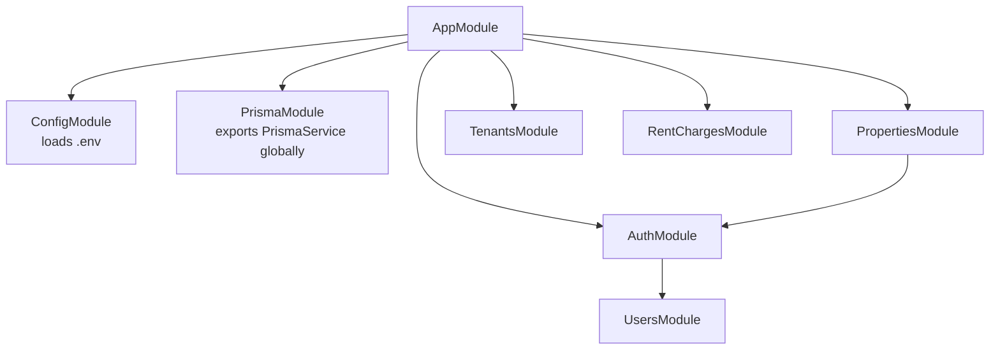

# Backend Mental Model

This document explains how the Renta Admin backend works today. It is meant to be a practical map of this codebase, not a full NestJS or Prisma course.

## Request Flow

Current real endpoint:

```text
GET /properties
  -> PropertiesController.findAll()
  -> PropertiesService.findAll()
  -> PrismaService
  -> PostgreSQL
  -> JSON response
```

In plain words:

1. The browser, Bruno, or curl sends an HTTP request.
2. NestJS matches the route to a controller method.
3. The controller delegates work to a service.
4. The service runs database queries through Prisma.
5. Prisma talks to PostgreSQL.
6. NestJS serializes the returned data as JSON.

## NestJS Files

| File | Responsibility |
| --- | --- |
| `src/main.ts` | Starts the NestJS app and listens on `process.env.PORT` or `3000`. |
| `src/app.module.ts` | Root module. Wires global config, Prisma, and feature modules into the app. |
| `src/app.controller.ts` | Root routes like `GET /` and `GET /health`. |
| `src/app.service.ts` | Root service logic, including the database health check. |
| `src/properties/properties.module.ts` | Feature module for properties. Registers the controller and service. |
| `src/properties/properties.controller.ts` | HTTP layer for property routes. Defines `GET /properties`. |
| `src/properties/properties.service.ts` | Business/data access layer for properties. Uses Prisma to query the database. |
| `src/prisma/prisma.module.ts` | Global module that provides `PrismaService` to the backend. |
| `src/prisma/prisma.service.ts` | Prisma client wrapper. Connects/disconnects from PostgreSQL using `DATABASE_URL`. |

## NestJS Modules, Decorators, And Injection

NestJS uses modules to tell the app which features exist.

Example:

```ts
@Module({
  controllers: [PropertiesController],
  providers: [PropertiesService],
})
export class PropertiesModule {}
```

What this means:

- `PropertiesModule` groups the properties feature.
- `controllers` are classes that receive HTTP requests.
- `providers` are classes Nest can create and inject, usually services.
- `PropertiesService` is injectable because it is listed in `providers`.

The root app imports feature modules:

```ts
@Module({
  imports: [PropertiesModule],
})
export class AppModule {}
```

What this means:

- `AppModule` is the root module.
- If a feature module is not imported by `AppModule` or by another imported module, Nest does not know it exists.
- Routes inside a module are registered only when that module is part of the module tree.

Common NestJS decorators:

| Decorator | Plain meaning |
| --- | --- |
| `@Module()` | Groups imports, controllers, and providers. |
| `@Controller('properties')` | This class handles routes that start with `/properties`. |
| `@Get()` | This method handles a `GET` request. |
| `@Injectable()` | Nest can create this class and inject it into another class. |
| `@Global()` | Makes a module's exported providers available app-wide. Use sparingly. |

Custom decorators:

```ts
@CurrentUser()
```

`@CurrentUser()` is a custom parameter decorator in this project. It reads `request.user`, which is set by `JwtGuard`, and passes the authenticated user payload into the controller method.

Before:

```ts
findAll(@Request() request: ExpressRequest) {
  return this.propertiesService.findAll(request.user);
}
```

After:

```ts
findAll(@CurrentUser() user: AuthenticatedUserPayload) {
  return this.propertiesService.findAll(user);
}
```

Why this helps:

- Controllers no longer import Express `Request`.
- Controllers no longer manually read `request.user`.
- The repeated auth plumbing is hidden behind one reusable decorator.

Dependency injection example:

```ts
constructor(private readonly propertiesService: PropertiesService) {}
```

What this means:

- The controller needs `PropertiesService`.
- Nest creates the service instance.
- Nest passes it into the controller constructor.
- For this to work, the service must be available in the module's `providers` or exported by an imported module.

In plain words, NestJS is mostly:

```text
decorators + modules + dependency injection
```

You describe the app structure with decorators and modules. Nest uses that metadata to create classes, connect dependencies, and register routes.

## Module Metadata Mental Model

Every NestJS module can have four common keys:

| Key | Plain meaning | Question it answers |
| --- | --- | --- |
| `imports` | Other modules this module depends on. | What do I need from outside? |
| `controllers` | HTTP route classes owned by this module. | What routes belong here? |
| `providers` | Injectable classes created by this module. | What services/guards can this module create? |
| `exports` | Providers/modules this module shares with other modules. | What am I making available outside? |

The most important one to understand is `providers`.

`providers` means:

```text
These are the classes Nest is allowed to create and inject into constructors.
```

Example:

```ts
@Module({
  controllers: [AuthController],
  providers: [AuthService],
})
export class AuthModule {}
```

Because `AuthService` is listed in `providers`, this works:

```ts
constructor(private readonly authService: AuthService) {}
```

If `AuthService` were not listed in `providers`, Nest could compile the TypeScript code but fail at runtime because it would not know how to create `AuthService`.

Providers are usually:

- Services
- Guards
- Strategies
- Repository/helper classes
- Any class Nest should create and inject

For now, the simplest mental model is:

```text
providers = injectable classes available inside this module
exports = providers/modules other modules are allowed to use
```

The confusing part is that TypeScript imports and Nest module imports are different.

```ts
import { UsersService } from '../users/users.service';
```

This means:

```text
TypeScript can reference the UsersService class.
```

But this:

```ts
@Module({
  imports: [UsersModule],
})
```

means:

```text
Nest can inject providers exported by UsersModule.
```

In short:

```text
TypeScript import = code can mention it
Nest module import = dependency injection can use it
```

## Current Module Wiring



What this means:

- `AppModule` is the root table of contents.
- `AuthModule` needs `UsersModule` because `AuthService` injects `UsersService`.
- `PropertiesModule` needs `AuthModule` because `PropertiesController` uses `JwtGuard`.
- `PrismaModule` is global, so services can inject `PrismaService` without importing `PrismaModule` in every feature module.

## Module Examples From This App

### UsersModule

```ts
@Module({
  providers: [UsersService],
  exports: [UsersService],
})
export class UsersModule {}
```

Meaning:

- This module creates `UsersService`.
- Other modules can use `UsersService` because it is exported.
- There is no controller because users are internal to auth for now.

### AuthModule

```ts
@Module({
  imports: [UsersModule, JwtModule.registerAsync(...)],
  controllers: [AuthController],
  providers: [AuthService, JwtGuard],
  exports: [JwtGuard, JwtModule],
})
export class AuthModule {}
```

Meaning:

- It imports `UsersModule` so `AuthService` can inject `UsersService`.
- It configures `JwtModule` so `AuthService` and `JwtGuard` can use `JwtService`.
- It owns `AuthController`, which exposes `POST /auth/login`.
- It creates `AuthService` and `JwtGuard`.
- It exports `JwtGuard` so other modules can protect routes.
- It exports `JwtModule` so tests or other modules can access the configured `JwtService` when needed.

### PropertiesModule

```ts
@Module({
  imports: [AuthModule],
  controllers: [PropertiesController],
  providers: [PropertiesService],
})
export class PropertiesModule {}
```

Meaning:

- It imports `AuthModule` because `PropertiesController` uses `JwtGuard`.
- It owns `PropertiesController`.
- It creates `PropertiesService`.
- It does not export anything yet because no other module needs `PropertiesService`.

## How To Read A Module

When a module feels confusing, read it in this order:

1. `controllers`: What HTTP routes does this feature expose?
2. `providers`: What injectable classes does this feature create?
3. `imports`: What does this feature need from other modules?
4. `exports`: What does this feature share with other modules?

Example:

```text
PropertiesModule
  controllers -> PropertiesController exposes /properties routes
  providers   -> PropertiesService runs property logic
  imports     -> AuthModule provides JwtGuard
  exports     -> nothing shared yet
```

## New Module Recipe

Example feature: `tenants`.

Folder:

```text
src/tenants/
  tenants.module.ts
  tenants.controller.ts
  tenants.service.ts
```

Service:

```ts
@Injectable()
export class TenantsService {
  findAll() {
    return this.prisma.tenant.findMany({
      where: { archivedAt: null },
      orderBy: { createdAt: 'asc' },
    });
  }
}
```

Controller:

```ts
@Controller('tenants')
export class TenantsController {
  constructor(private readonly tenantsService: TenantsService) {}

  @Get()
  findAll() {
    return this.tenantsService.findAll();
  }
}
```

Feature module:

```ts
@Module({
  controllers: [TenantsController],
  providers: [TenantsService],
})
export class TenantsModule {}
```

Root module:

```ts
@Module({
  imports: [TenantsModule],
})
export class AppModule {}
```

The flow would be:

```text
GET /tenants
  -> TenantsController.findAll()
  -> TenantsService.findAll()
  -> PrismaService
  -> PostgreSQL
  -> JSON response
```

This is the basic NestJS feature pattern:

1. Create a feature folder.
2. Put route methods in the controller.
3. Put business/data logic in the service.
4. Register controller and service in the feature module.
5. Import the feature module into `AppModule`.

## Prisma Files

| File | Responsibility |
| --- | --- |
| `prisma/schema.prisma` | Source of truth for database models, relations, enums, and Prisma client generation. |
| `prisma/migrations/*/migration.sql` | SQL history of database structure changes. These files are applied to PostgreSQL. |
| `prisma.config.ts` | Prisma CLI config: schema location, migration folder, seed command, and database URL. |
| `prisma/seed.ts` | Inserts useful local development data into the database. |

## Current Endpoint Walkthrough

Endpoint:

```text
GET /properties
```

Controller:

```ts
@Controller('properties')
export class PropertiesController {
  constructor(private readonly propertiesService: PropertiesService) {}

  @Get()
  findAll() {
    return this.propertiesService.findAll();
  }
}
```

What this means:

- `@Controller('properties')` makes every route in this controller start with `/properties`.
- `@Get()` means this method handles `GET /properties`.
- The controller does not query the database directly.
- It calls `PropertiesService.findAll()` and returns its result.

Service:

```ts
async findAll() {
  const workspace = await this.prisma.workspace.findFirst({
    where: { name: 'Propiedades Morelia' },
  });

  if (!workspace) {
    throw new NotFoundException('Workspace "Propiedades Morelia" not found');
  }

  return this.prisma.property.findMany({
    where: {
      workspaceId: workspace.id,
      archivedAt: null,
    },
    include: {
      units: {
        where: { archivedAt: null },
        orderBy: { createdAt: 'asc' },
      },
    },
    orderBy: { createdAt: 'asc' },
  });
}
```

What this means:

- First it finds the temporary workspace named `Propiedades Morelia`.
- This is temporary. Later, the workspace should come from auth/session/workspace selection.
- If the workspace does not exist, the API returns `404`.
- Then it returns active properties from that workspace.
- `archivedAt: null` means soft-deleted records are hidden.
- `include.units` loads the units that belong to each property.
- Unit records are also filtered by `archivedAt: null`.

## Prisma Service

`PrismaService` extends `PrismaClient`, so other backend services can do typed queries like:

```ts
this.prisma.property.findMany(...)
this.prisma.tenant.findFirst(...)
this.prisma.rentCharge.findMany(...)
```

The service uses:

```ts
const adapter = new PrismaPg({ connectionString: databaseUrl });
super({ adapter });
```

That is needed because this project uses Prisma 7 with PostgreSQL. The adapter tells Prisma how to connect to the database.

Lifecycle hooks:

- `onModuleInit()` connects Prisma when Nest starts.
- `onModuleDestroy()` disconnects Prisma when Nest shuts down.

## Database Model Mental Model

Main ownership chain:

```text
Workspace
  -> Property
    -> Unit
      -> Contract
        -> RentCharge
          -> Payment
```

Supporting records:

```text
Workspace
  -> Tenant
  -> Expense
  -> WorkspaceMember
```

In plain words:

- A `Workspace` is the business boundary.
- A `WorkspaceMember` is the join record between a user and a workspace.
- A `Property` is a house/building/place.
- A `Unit` is a rentable room, department, or space.
- A `Tenant` is the person renting.
- A `Contract` connects a tenant to a unit with rent terms.
- A `RentCharge` means rent is owed for a specific month.
- A `Payment` means money was received for a rent charge.
- An `Expense` is money spent on a property or unit.

`WorkspaceMember` vs membership:

```text
WorkspaceMember = Prisma model/table name
membership = plain English name for one WorkspaceMember record
memberships = many WorkspaceMember records
```

Example:

```text
User: Daniel
Workspace: Propiedades Morelia
Role: OWNER
```

That relationship row is a workspace membership.

## RentCharge And Payment

The user-facing UI can stay simple, but the backend separates debt from money received.

| Concept | Example | Meaning |
| --- | --- | --- |
| `Contract` | Ana rents Cuarto 1 for `$3,500/month` | The rental agreement. |
| `RentCharge` | June rent: `$3,500` due | The monthly debt. |
| `Payment` | Ana paid `$2,000` | Money received toward that debt. |

Example:

| Month | Owed | Paid | Status |
| --- | ---: | ---: | --- |
| June | `$3,500` | `$0` | `PENDING` |
| June | `$3,500` | `$2,000` | `PARTIAL` |
| June | `$3,500` | `$3,500` | `PAID` |

MVP rule:

- Use `PENDING`, `PARTIAL`, and `PAID`.
- Do not build complex accounting yet.
- Do not build refunds, reversals, invoices, or automatic overdue jobs yet.

## Testing Mental Model

Current backend tests use two styles:

| Test type | What it checks |
| --- | --- |
| Unit test | A class or method in isolation, usually with dependencies mocked. |
| E2E test | HTTP route, Nest module wiring, service, Prisma, and database together. |

Why e2e was useful early:

- The biggest risk was not business logic yet.
- The biggest risk was wiring: route, module imports, env loading, Prisma, and PostgreSQL.
- `GET /health` and `GET /properties` e2e tests prove that the backend is actually connected.

## Interview Answers

### Why separate controller and service?

The controller handles HTTP concerns like routes, params, and status codes. The service handles business logic and data access. This keeps route code thin and makes business logic easier to test and reuse.

### Why use Prisma?

Prisma gives typed database queries, model relations, migrations, and a safer way to work with PostgreSQL from TypeScript. It reduces raw SQL for common app logic while still allowing raw SQL when needed.

### Why use migrations?

Migrations keep database structure changes versioned. Instead of manually changing tables, the team can apply the same schema changes consistently across local, staging, and production databases.

### Why seed data?

Seed data makes local development predictable. It gives the app real-looking records so endpoints, UI screens, and tests can be exercised without manually entering data every time.

### Why e2e tests here?

At this stage, e2e tests verify the backend wiring and database integration. Unit tests become more valuable when services contain more business rules, validations, and branching logic.

### Why separate RentCharge and Payment?

A rent charge is what the tenant owes. A payment is money received. Keeping them separate supports partial payments, payment history, attachments, and reports while the UI can still show a simple paid/not paid experience.

## Known Temporary Choices

- `GET /properties` uses the hardcoded workspace name `Propiedades Morelia`.
- Pagination is not implemented yet.
- The endpoint returns Prisma-shaped data directly instead of response DTOs.
- Auth, workspace selection, RBAC, file attachments, and write flows are still future phases.

## Error Handling Direction

Early services can throw NestJS HTTP exceptions directly when the rule is simple:

```ts
throw new NotFoundException('Property not found');
```

This is acceptable for simple cases like missing records.

As the backend grows, error handling should become more consistent:

- Services should validate business rules before writing data.
- Controllers should stay thin and not contain business rules.
- Repeated error patterns should be extracted instead of duplicated.
- Sensitive internal errors should not leak database details to API clients.
- Tests should cover important error cases, especially `404`, `400`, and permission errors.
